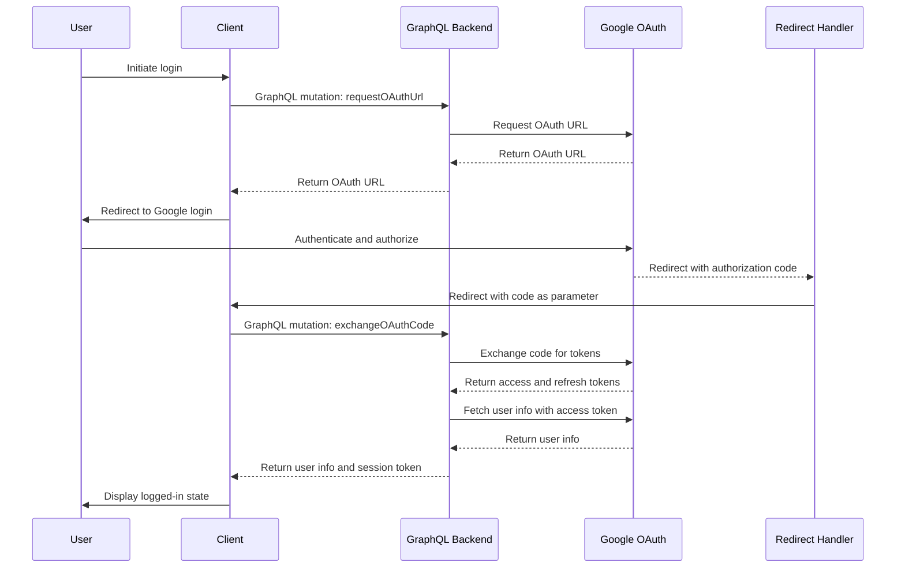

<!-- <script src="https://cdn.jsdelivr.net/npm/mermaid@8.4.8/dist/mermaid.min.js"></script> -->
# Quick Auth
## Overview
This project implements a full-stack authentication system using OAuth 2.0, built with React.js for the frontend and Node.js for the backend. It enables secure user authentication and authorization using OAuth 2.0 providers (e.g., Google, GitHub) and provides a foundation for managing protected resources.

---
## Features
- OAuth 2.0 authentication with third-party providers
- Secure user login and session management
- Email-based user registration and login
- Node.js backend with RESTful API endpoints
- JWT-based authentication for protected routes
- Type-safe backend and frontend with TypeScript
- Database management with Prisma ORM
- Environment-based configuration for flexibility

---
## Tech Stack
- Frontend: React.js, Axios, Tailwind CSS
- Backend: Node.js, Express.js
- Authentication: OAuth 2.0, JSON Web Tokens (JWT)
- Database: PostgreSQL
- Email: Handlebars for email templates, Nodemailer for email delivery
- Other Tools: npm, yarn, dotenv for environment variables

---
## Prerequisites
- Node.js (v16 or higher)
- Yarn: v1.22 or higher
- An OAuth 2.0 provider account (e.g., Google, GitHub) for client ID and secret
- PostgreSQL for persistent storage
- Email Service: SMTP service (e.g., Gmail, SendGrid) for password reset emails

---
## Project Structure
```bash
OAuth-2.0-Repository/
├── quickAuth-nodejs/                  # Backend (Node.js + TypeScript)
│   ├── prisma/                        # Prisma ORM configuration
│   │   ├── migrations/                # Database migration files
│   │   │   ├── 20230124063002_init/   # Initial migration
│   │   │   │   └── migration.sql      # Migration SQL
│   │   │   └── migration_lock.toml    # Prisma migration lock
│   │   └── schema.prisma              # Prisma schema definition
│   ├── public/                        # Static assets
│   │   └── default.png                # Default image
│   ├── src/                           # Backend source code
│   │   ├── controllers/               # Request handlers
│   │   │   ├── auth.controller.ts     # Authentication logic
│   │   │   └── user.controller.ts     # User-related logic
│   │   ├── email/                     # Email functionality
│   │   │   ├── templates/             # Handlebars email templates
│   │   │   │   ├── layouts/           # Base layout for emails
│   │   │   │   │   └── base.hbs      # Base email template
│   │   │   │   ├── partials/          # Reusable template partials
│   │   │   │   │   └── styles.hbs    # Email styles
│   │   │   │   └── reset_password.hbs # Password reset email template
│   │   │   ├── renderTemplate.ts      # Template rendering logic
│   │   │   └── transporter.ts         # Email transport configuration
│   │   ├── middleware/                # Express middleware
│   │   │   ├── deserializeUser.ts     # User deserialization for sessions
│   │   │   ├── requireUser.ts         # Protect routes requiring authentication
│   │   │   └── validate.ts            # Input validation middleware
│   │   ├── routes/                    # API routes
│   │   │   ├── auth.route.ts          # Authentication routes (login, OAuth)
│   │   │   ├── session.route.ts       # Session management routes
│   │   │   └── user.route.ts          # User management routes
│   │   ├── schema/                    # Validation schemas
│   │   │   └── user.schema.ts         # User data validation
│   │   ├── services/                  # Business logic
│   │   │   └── session.service.ts     # Session management service
│   │   ├── utils/                     # Utility functions
│   │   │   ├── prisma.ts              # Prisma client setup
│   │   │   └── random.ts              # Random string generation
│   │   └── app.ts                     # Express app setup
│   ├── package.json                   # Backend dependencies
│   ├── tsconfig.json                  # TypeScript configuration
│   └── yarn.lock                      # Yarn lock file
├── quickAuth-reactjs/                 # Frontend (React.js + TypeScript)
│   ├── public/                        # Static assets
│   │   ├── default.png                # Default image
│   │   └── vite.svg                   # Vite logo
│   ├── src/                           # Frontend source code
│   │   ├── assets/                    # Images and icons
│   │   │   ├── default.png            # Default image
│   │   │   ├── github.svg             # GitHub icon
│   │   │   ├── google.svg             # Google icon
│   │   │   └── react.svg              # React icon
│   │   ├── components/                # Reusable React components
│   │   │   ├── FormInput.tsx          # Form input component
│   │   │   ├── Header.tsx             # Header component
│   │   │   ├── Layout.tsx             # Layout wrapper
│   │   │   ├── LoadingButton.tsx      # Button with loading state
│   │   │   ├── Message.tsx            # Message display component
│   │   │   └── Spinner.tsx            # Loading spinner
│   │   ├── pages/                     # Page components
│   │   │   ├── forgotpassword.page.tsx # Forgot password page
│   │   │   ├── home.page.tsx          # Home page
│   │   │   ├── login.page.tsx         # Login page
│   │   │   ├── profile.page.tsx       # User profile page
│   │   │   ├── register.page.tsx      # Registration page
│   │   │   └── resetpassword.page.tsx # Password reset page
│   │   ├── router/                    # Routing configuration
│   │   │   └── index.tsx              # Router setup
│   │   ├── store/                     # State management
│   │   │   ├── index.ts               # Store configuration
│   │   │   └── types.ts               # Store types
│   │   ├── utils/                     # Utility functions
│   │   │   └── getGoogleUrl.ts        # Generate Google OAuth URL
│   │   ├── App.tsx                    # Main React app
│   │   ├── index.css                  # Global CSS
│   │   ├── main.tsx                   # Entry point
│   │   └── vite-env.d.ts              # Vite environment types
│   ├── index.html                     # HTML entry point
│   ├── package.json                   # Frontend dependencies
│   ├── postcss.config.cjs             # PostCSS configuration
│   ├── tailwind.config.cjs            # Tailwind CSS configuration
│   ├── tsconfig.json                  # TypeScript configuration
│   ├── tsconfig.node.json             # TypeScript Node configuration
│   ├── vite.config.ts                 # Vite configuration
│   └── yarn.lock                      # Yarn lock file
└── README.md                          # Root documentation
```

---
## Installation
### 1. Clone the Repository
```bash
git clone https://github.com/dev-dhanushkumar/OAuth-2.0-Repository.git
cd OAuth-2.0-Repository
```
### 2. Setup quickAuth-nodejs
**1. Navigate to the `quickAuth-nodejs` directory:**
```bash
cd quickAuth-nodejs
```
**2. Install all the required dependencies:**
```bash
yarn install
```
**3. Duplicate the `example.env` file and rename the copied one to `.env`**

**4. Run the Prisma schema to the Postgres database.**
```bash
npx prisma db push
```
**5. Start the Express server:**
```bash
yarn start
```

### 3. Setup quickAuth-reactjs
**1. Navigate to the `quickAuth-reactjs` directory:**
```bash
cd quickAuth-reactjs
```
**2. Install all the required dependencies:**
```bash
yarn install
```
**3. Duplicate the `example.env` file and rename the copied one to `.env`**

**4. Start the Vite development server:**
```bash
yarn dev
```

---
## Usage
- Access the frontend at `http://localhost:3000`.
- Use the Login or Register pages for email-based authentication.
- Click Login with Google for OAuth 2.0 authentication.
- Use the Forgot Password page to initiate a password reset via email.
- Access the Profile page to view user details (requires authentication).
- The backend API is available at `http://localhost:8000`.

---

## API Endpoints
Below is a detailed description of each API endpoint, including its purpose, request details, and response format.

### **1. `POST /api/auth/register`**
- **Description:** Registers a new user with email and password. Validates input using createUserSchema and creates a user record in the database.
- **Request:**
    - **Method:** POST
    - **Body:** JSON object with name, email,password and confirm password user fields
    - **Example:**
    ```json
        {
            "name":"Sam",
            "email":"sam030704@gmail.com",
            "password":"123!@#qazPLM",
            "passwordConfirm":"123!@#qazPLM"
        }
    ```
- **Response:**
    - Success (201): Returns the created user object
    ```json
        {
            "status": "success",
            "data": {
                "user": {
                    "id": "5d261087-2cf0-4a58-9b20-3e776eef9fc8",
                    "name": "Sam",
                    "email": "sam030704@gmail.com",
                    "role": "user",
                    "photo": "default.png",
                    "verified": false,
                    "provider": "local",
                    "password_reset_token": "",
                    "password_reset_at": "1970-01-01T00:00:00.000Z",
                    "createdAt": "2025-06-13T16:24:20.409Z",
                    "updatedAt": "2025-06-13T16:24:20.443Z"
                }
            }
        }
    ```
    - **Error (400): Invalid input or user already exists.**
    ```json
        {
          "status": "error",
          "message": "Email already exists"
        }
    ```
- **ScreenShot:**
    


### **2. `POST /api/auth/login`**
- **Description:** Authenticates a user with `email` and `password`. Validates input using loginUserSchema and returns a `JWT` upon successful login.
- **Request:**
    - **Method:** POST
    - **Body:** JSON object with `email` and `password`.
    - **Example:**
    ```json
        {
            "email":"sam0307204@gmail.com",
            "password":"123!@#qazPLM"
        }
    ```
- **Response:**
    - Success (200): Returns the authenticated user and a JWT.
    ```json
        {
            "status": "success"
        }
    ```
    - JWT Token stored in Browser Cookies.
    ```text
      token=eyJhbGciOiJIUzI1NiIsInR5cCI6IkpXVCJ9.eyJzdWIiOiI0ZjE0OWZmNy01Mzk1LTRkODItODViOC1iN
      jIyZWU3YjA4ZTYiLCJpYXQiOjE3NDk4MzM3MjcsImV4cCI6MTc0OTgzNzMyN30.EF_FG2eouSgTMwUUDUK-xHR2v
      TCKM6fGjW-eD0znmvU; Path=/; Expires=Fri, 13 Jun 2025 17:55:27 GMT;
    ```
    - **Error (401):**  Invalid credentials.
    ```json
        {
            "status": "fail",
            "message": "Invalid email or password"
        }
    ```
- **ScreenShot:**
    - Login:
    
    - JWT Token in Cookie:
    

### **3. `GET /api/users/me`**
- **Description:** Retrieves the authenticated user’s profile. Requires a valid JWT, enforced by deserializeUser and requireUser middleware.
- **Request:**
    - **Method:** GET
    - **Headers:** Authorization: Bearer <jwt-token>
- **Response:**
    - **Success (200):** Returns user profile.
    ```json
    {
        "status": "success",
        "data": {
            "user": {
                "id": "4f149ff7-5395-4d82-85b8-b622ee7b08e6",
                "name": "Sam",
                "email": "sam0307204@gmail.com",
                "role": "user",
                "photo": "default.png",
                "verified": false,
                "provider": "local",
                "password_reset_token": "",
                "password_reset_at": "1970-01-01T00:00:00.000Z",
                "createdAt": "2025-06-13T14:45:19.601Z",
                "updatedAt": "2025-06-13T14:45:19.603Z"
            }
        }
    }
    ```
    - **Error(401):** Unauthorized if no valid JWT.
    ```json
    {
      "status": "error",
      "message": "Unauthorized"
    }
    ```
- **ScreenShot:**
    


### **4. `GET /api/auth/logout`**
- **Description:** Logs out the authenticated user by invalidating their session. Requires a valid JWT, enforced by deserializeUser and requireUser middleware.
- **Request:**
    - **Method:** GET
    - **Headers:** Authorization: Bearer <jwt-token>
- **Response:**
    - Success (200): Confirms logout.
    ```json
        {
            "status": "success"
        }
    ```
    - **Error (401):** Unauthorized if no valid JWT.
    ```json
        {
          "status": "error",
          "message": "Unauthorized"
        }
    ```

###  **5. `POST /api/auth/forgotpassword`**
- **Description:** Initiates a password reset by sending an email with a reset token. Validates input using forgotPasswordSchema.
- **Request:**
    - **Method:** POST
    - **Body:** JSON object with email.
    - **Example:**
    ```json
        {
          "email": "sam@gmail.com"
        }
    ```
- **Response:**
    - Success (200): Confirms email sent.
    ```json
        {
            "status": "success"
            "message":"You will receive a password reset email if user with that email exists"
        }
    ```
    - **Error (404):** Unauthorized if no valid JWT.
    ```json
        {
          "status": "error",
          "message": "You will receive a password reset email if user with that email exists"
        }
    ```


###  **6. `PATCH /api/auth/resetpassword/:passwordResetToken`**
- **Description:** Resets the user’s password using a reset token. Validates input using `resetPasswordSchema`.
- **Request:**
    - **Method:** PATCH
    - **Body:** JSON object with `password` and `passwordConfirm`.
    - **Example:**
    ```json
        {
          "password":"newPassword",
          "passwordConfirm":"newPassword"
        }
    ```
- **Response:**
    - Success (200): Confirms password reset.
    ```json
        {
          "status": "success",
          "message": "Password reset successfully"
        }
    ```
    - **Error (400):** Invalid or expired token.
    ```json
        {
          "status": "error",
          "message": "Invalid or expired reset token"
        }
    ```
       
---
## Project Demo 

### OAuth2.0 Authentication Demo

https://github.com/user-attachments/assets/a9083f24-2c0f-482e-abd9-c01b37c6e96c

### Forgot Password and Reset Password Demo

https://github.com/user-attachments/assets/ca160dca-44d3-4c5a-9107-638dfc143354

---
## ALL OAUTH PROJECT DEVELOPMENT


